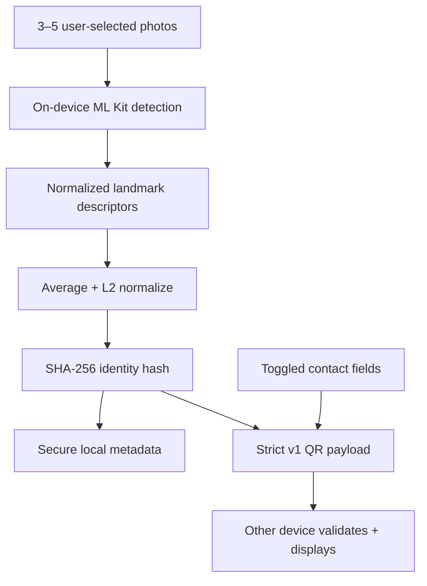

# Architecture and implementation plan

## Short implementation plan

1. Ship typed navigation and card creation first.
2. Encode only allowlisted shared fields; validate every scanned byte.
3. Centralize RevenueCat purchase and entitlement logic.
4. Keep self-enrollment native and local behind one replaceable interface.
5. Add exports, deletion, tests, and store materials without adding a backend.

## Data flow

Photos, landmarks, and averaged descriptors stop before QR creation. No app code sends them over a network.

## Trust boundaries

| Boundary | Rule |
| --- | --- |
| Enrollment input | Only picker/camera images explicitly chosen for self-enrollment; never an ambient stranger-identification camera. |
| Identity computation | Native local detector; no URLs or upload clients in `IdentityService`. |
| Protected storage | SHA-256 hash and extractor metadata only; this-device-only keychain accessibility on iOS. |
| Card storage | Non-biometric configuration in app-local storage for fast edits/backups. |
| QR output | Local ID plus name/tagline only when enabled, plus allowlisted toggled fields. |
| QR input | Maximum 2,400 UTF-8 bytes, strict version/type, strict property set, per-field limits, HTTP(S)-only URLs, expiry check. |
| Purchases | RevenueCat receives store/customer purchase state only; no FaceCard identity or contact payload. |

## Deliberate non-features

No backend, login, registry, feed, messaging, analytics, ads, discovery, profile photos on cards, remote config beyond RevenueCat offerings, or person matching.

## Production embedding upgrade seam

Replace `IdentityService.createEmbedding(face, image)` with a bundled offline model pipeline:

1. Use ML Kit bounds/eye landmarks to crop and similarity-align a 112×112 RGB face.
2. Run a bundled, licensed MobileFaceNet/ArcFace-style TFLite model with `react-native-fast-tflite` or a small custom Expo module.
3. L2-normalize each vector, reject low-quality/outlier captures, average, normalize again, quantize canonically, and hash.
4. Bump `EMBEDDING_VERSION` so old and new identities cannot be confused.
5. Keep the feature explicitly limited to self-enrollment. Do not add comparison/search APIs.

The current MVP does not fake this model: the limitation is stated in onboarding, README, policy draft, and service constant.
